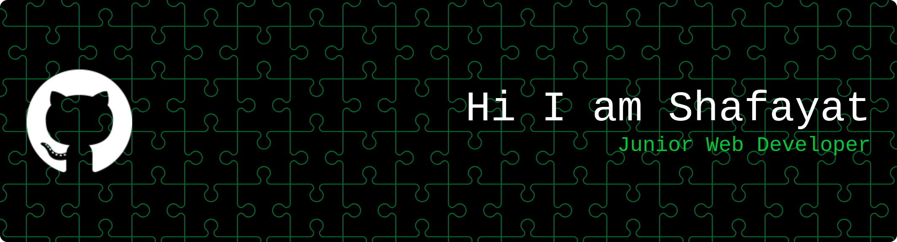

  <ul align="center" style="list-style: none">
    

      
    

  </ul>

**<h3 align="left">Connect with me:</h3>** 

  

 **<h3 align="left">Junior web developer learning JavaScript, React, and Next.js. Passionate about building responsive and user-friendly websites. Always eager to learn new technologies and improve my skills.</h3>**

**<h3 align="left">Rapid Fire</h3>**

- 💼 I'm currently working on: **💻 Developing a new e-learning platform using React and Next.JS**
- 🌱 I'm currently learning: **📚 Exploring Next.JS**
- 💬 Ask me about: **💡 HTML5, CSS3, TailwindCSS, JavaScript, React, Next.JS**

 **<h3 align="left">Skills</h3>**

     

